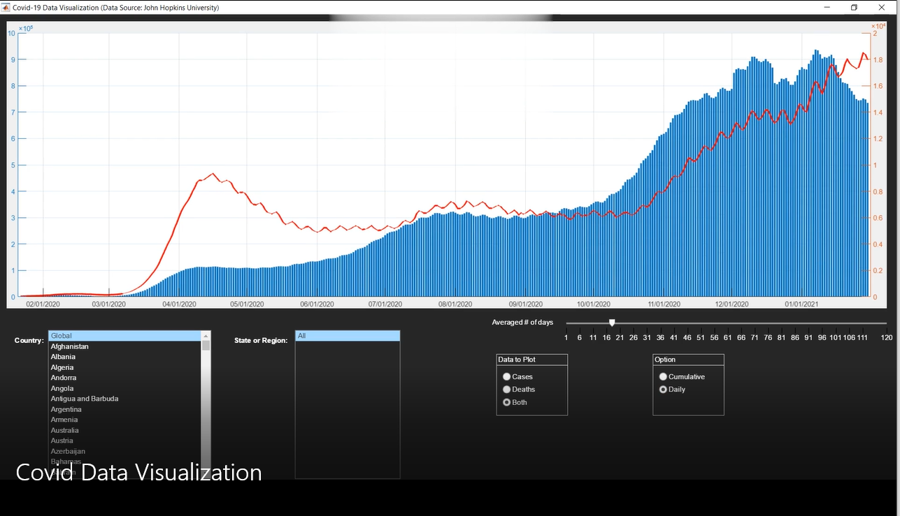

# About
Simple data visualization on Matlab

This application is written on MATLAB framework. The application illusturates death and case number of Coranavirus over the date. The dataset is provided from John Hopkins University and here is the link below :  
https://coronavirus.jhu.edu/about/how-to-use-our-data

Here is a quick representation of app:

